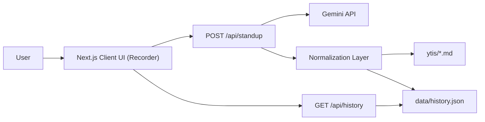
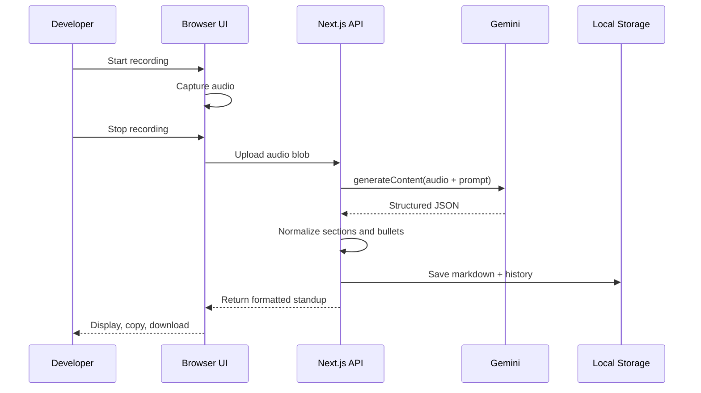

# YTI Voice Recorder

[](https://github.com/glucode-mpho/yti-formatter/actions/workflows/test.yml)
[](https://nextjs.org/)
[](https://www.typescriptlang.org/)

Voice-driven standup assistant for developers.  
Record once, then get a clean **Yesterday / Today / Impediments** update, saved to markdown and local history.

## About

YTI Voice Recorder is designed for low-friction daily updates:

- Fast microphone capture in browser
- Gemini-powered transcript structuring
- Bullet cleanup and normalization
- Local persistence for history and markdown exports

## Features

- Microphone recording with dual engine fallback:
  - `MediaRecorder` (primary)
  - `Web Audio` PCM to WAV (fallback)
- Gemini JSON prompting for structured Y/T/I
- Local file outputs:
  - `ytis/YYYY-MM-DD_yti.md`
  - `data/history.json`
- Clipboard and markdown download support
- Polished, responsive UI

## Architecture (UML)





## Tech Stack

- Next.js 16 (App Router)
- TypeScript
- ESLint
- GitHub Actions
- Gemini API (server route)

## Local Setup

### 1. Install

```bash
npm install
```

### 2. Configure environment

```bash
cp .env.local.example .env.local
```

Set:

```bash
GEMINI_API_KEY=your_key_here
GEMINI_MODEL=gemini-2.0-flash
DEFAULT_STANDUP_NAME=Your Name
```

### API Key Modes

- User key (required in browser UI): when the app opens, users first see a modal that requires a Gemini API key before recording. The client sends it per request as `x-gemini-api-key`.
- Server key (fallback for server-to-server calls): set `GEMINI_API_KEY` in `.env.local` (or your deployment secret manager) for integrations that call `/api/standup` without a request key.
- Session behavior: the browser stores the API key in `sessionStorage` only for the current session.
- Logout behavior: clicking `Logout` clears session data (including API key) and locks the app until a key is entered again.

Security note:
- Never commit real keys to git.
- If a real key was previously committed, rotate/revoke it in Google AI Studio immediately.

### 3. Run

```bash
npm run dev
```

Open [http://localhost:3000](http://localhost:3000), allow microphone access, and record.

## Scripts

- `npm run dev`: start development server
- `npm run lint`: lint source files
- `npm run typecheck`: run TypeScript checks
- `npm run build`: production build
- `npm run check`: lint + typecheck + build
- `npm run start`: run production server

## Upcoming Features

- Optional sign up / sign in: create an account only if you want persistent data.
- Saved API key for account users: keep your Gemini API key tied to your account instead of re-entering it each session.
- Persistent YTI history for account users: retain and access standup history across sessions and devices.
- Keep no-account mode: continue using the app without creating an account.

## Project Structure

```text
src/
  app/
    api/
      history/route.ts
      standup/route.ts
    about/page.tsx
    how-it-works/page.tsx
    layout.tsx
    page.tsx
  components/
    yti-recorder.tsx
  lib/
    audio.ts
    standup.ts
    storage.ts
    types.ts
```

## CI

Workflow: `.github/workflows/test.yml`

Runs on push, pull request, and manual dispatch:

- install (`npm ci`)
- lint
- typecheck
- build
